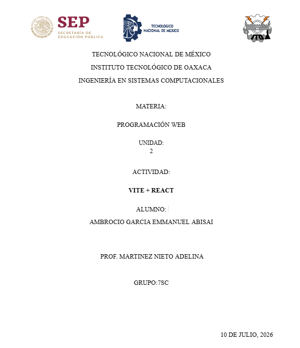
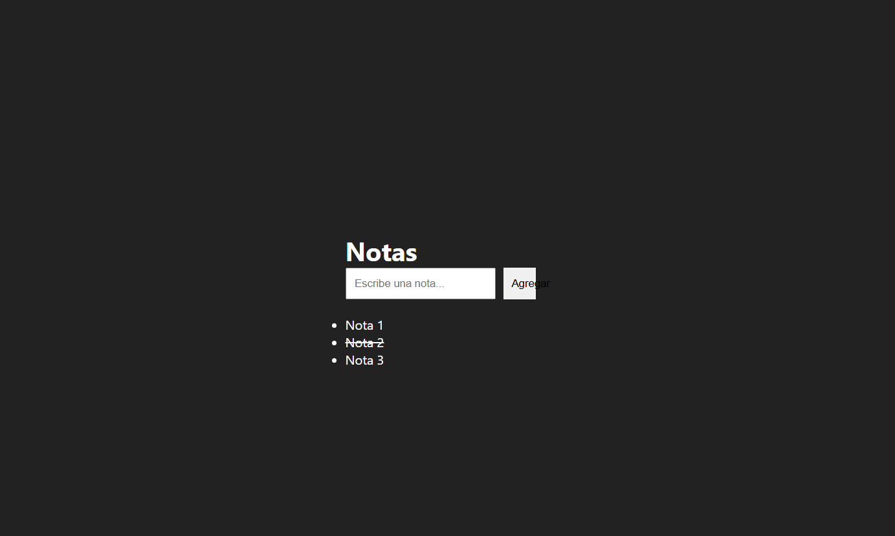
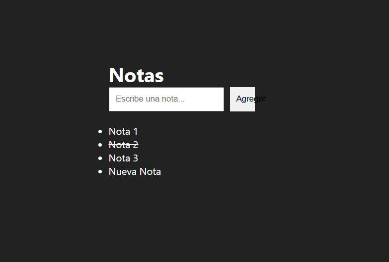

# App  React

## Sobre el proyecto

Esta es mi primera mini aplicación hecha con **React + Vite**. Es una app de notas donde puedes agregar notas nuevas, verlas en una lista, y marcarlas como completadas dándoles click (se tachan). La idea era practicar los conceptos básicos de React: componentes, props, estado y renderizado de listas.

Seguí el curso **"CURSO de REACT desde cero 2025 – Aprende React Desde Cero"** para aprender la configuración inicial del proyecto con Vite: [https://youtube.com/watch?v=2xhAcqhSuVU](https://youtube.com/watch?v=2xhAcqhSuVU&authuser=0) (a partir de la hora 2, donde se explica cómo armar formularios, listas dinámicas y editar elementos en pantalla).

Con eso como base arme mi propia versión: un formulario para escribir y agregar notas nuevas, una lista que se genera dinámicamente a partir de esas notas.

## Componentes del proyecto

- **`Titulo.jsx`**  componente simple, solo muestra el título de la app.
- **`NotaItem.jsx`**  componente que recibe props (el texto de la nota, si está completada, y la función para marcarla).
- **`TodoApp.jsx`**  componente principal, aquí vive el estado (`useState`) de las notas y del input, y aquí se arma la lista con `.map()`.

## Tecnologías usadas

- React
- Vite
- CSS Modules

---

## Preguntas

**1.- ¿Qué diferencia hay entre props y state en React?**

Las props son como información que le pasa un componente "papá" a un componente "hijo" y el hijo no la puede cambiar, solo la recibe y la usa. En cambio el state es información que vive DENTRO del propio componente, y ese componente sí la puede cambiar cuando algo pasa, como un click o cuando escribes algo. En mi proyecto, `NotaItem` recibe props pero quien controla y cambia esa información es `TodoApp` que es quien tiene el estado.

**2.- ¿Por qué es importante usar una key al renderizar una lista de elementos?**

La key le ayuda a React a saber cuál elemento es cuál dentro de una lista, para que cuando algo cambie (se agregue, se borre o se actualice una nota), React solo actualice esa nota específica en vez de rehacer toda la lista completa. Si no le pones key o le pones una repetida, React se puede confundir y actualizar mal los elementos, o tirarte un warning en la consola dentro de la web.

**3.- Explica con tus propias palabras qué hace la función useState y da un ejemplo de dónde la usaste en tu mini aplicación.**

`useState` es un hook que te deja crear una variable que React "vigila", y cada vez que esa variable cambia, React actualiza automáticamente lo que se ve en pantalla. Es como una variable normal pero en vez de solo cambiar su valor, cuando la actualizas con su función (`set...`), React vuelve a pintar la pantalla con el valor nuevo.

En mi proyecto lo uso dos veces dentro de `TodoApp.jsx`:
- `const [notas, setNotas] = useState([...])`  guarda el arreglo de todas lass notas, y cada vez que agrego o se actualiza la lista en pantalla.
- `const [nuevaNota, setNuevaNota] = useState("")`  guarda lo que voy escribiendo en el input antes de agregar la nota.

**Repositorio Github:**
 https://github.com/emmaabisa/t3_act5_react

**web con GitHub Pages:**
https://emmaabisa.github.io/t3_act5_react/